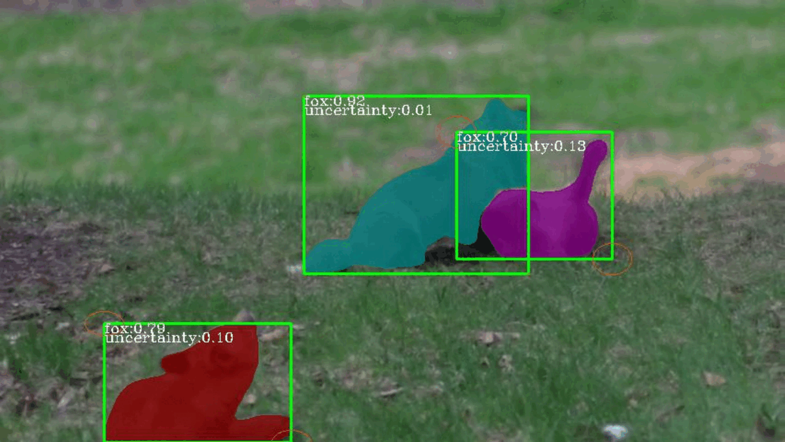
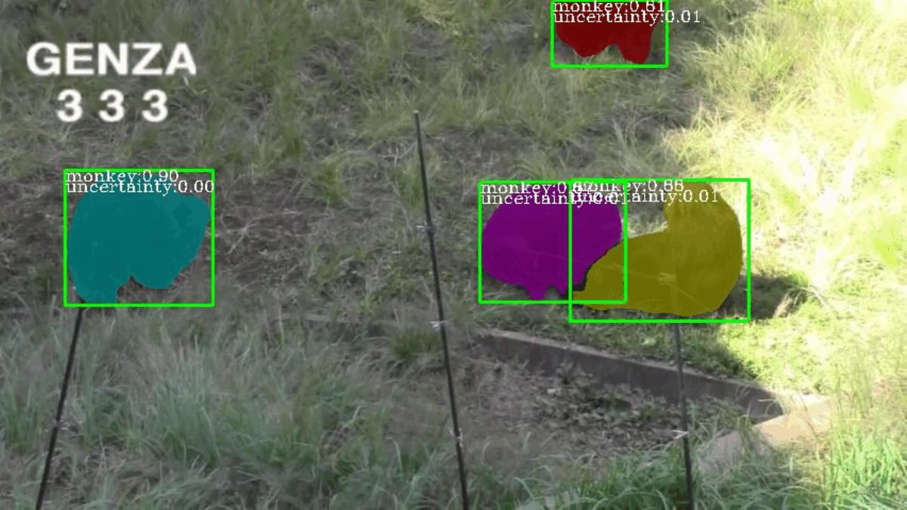

# MemCNP-VIS for YouTube-VIS and OVIS

This repo serves as the official code release of the MemCNP-VIS model in the paper:

## [A Memory-based Conditional Neural Process for Video Instance Segmentation](https://papers.ssrn.com/sol3/papers.cfm?abstract_id=4630924)


Some results can be seen below:

<table style="display:flex;justify-content:center;border:0" rules=none frame=void >
<tr>
<td>
</td>
<td>
</td>
<td>
</td>
<td>
</td>

<tr>
<td>
</td>
<td>
</td>
<td>
</td>
<td>
</td>
</tr>
<tr>

</tr>
</table>

For more details about the dataset, please refer to our paper.

## Model training and evaluation

### Installation

This repo is built based on [MaskTrackRCNN](https://github.com/youtubevos/MaskTrackRCNN), [SipMask](https://github.com/JialeCao001/SipMask) and a customized [FCOS](https://github.com/tianzhi0549/FCOS).

You can use following commands to create conda env with all dependencies. 

Modify ``cuda`` and corresponding ``torch`` version.
```
conda env create -f env_conda.yml
conda activate memcnp

conda install -c pytorch pytorch=1.3.1 torchvision=0.2.2 cudatoolkit=10.0 -y
pip install -r env_pip.txt
pip install git+https://github.com/youtubevos/cocoapi.git#"egg=pycocotools&subdirectory=PythonAPI"
conda install six matplotlib
```

Change the ``cuda`` path in ``compile.sh`` to your correct directory
```
bash compile.sh
```

### Data preparation
1. Download [YIVS](https://youtube-vos.org/dataset/vis/) and [OVIS](http://songbai.site/ovis/).
2. Symlink the train/validation dataset to `data/OVIS/` folder. Put COCO-style json annotations under `data/annotations`.

```
mmdetection
├── ...
├── mmdet
├── tools
├── configs
├── data
│   ├── OVIS
│   │   ├── train_images
│   │   ├── valid_images
│   │   ├── annotations
│   │   │   ├── annotations_train.json
│   │   │   ├── annotations_valid.json
│   │   │   ├── annotations_test.json
├── ├── YVIS
│   │   ├── train_images
│   │   ├── valid_images
│   │   ├── annotations
│   │   │   ├── instances_train.json
│   │   │   ├── instances_valid.json
│   │   │   ├── instances_test.json
```

### Training
Our default model is based on ViT-b_SipMask. The model is pretrained on ImageNet using MAE. [model link](https://dl.fbaipublicfiles.com/mae/pretrain/mae_pretrain_vit_base.pth).

Run the command below to train the model.
```
CUDA_VISIBLE_DEVICES=0,1,2,3 python -u train.py configs/vitmae_cnp_contrast_ms_1x.py --work_dir 
./workdir/vit-b_memcnp_yvis --gpus 4
```
To change training configurations such as learning rate, model parameters, and dataset, please refer to `vitmae_cnp_contrast_ms_1x.py`.

### Evaluation
Our pretrained model is available for download at [Google Drive](https://drive.google.com/file/d/1MOV12JM1IXW16AU6_2UyvaxcyCxJlJkv/view?usp=sharing).
Run the following command to evaluate the model on YVIS.
```
CUDA_VISIBLE_DEVICES=0 python test_video.py configs/vitmae_cnp_contrast_ms_1x.py [MODEL_PATH] --out [OUTPUT_PATH.pkl] --eval segm
```

A json file containing the predicted result will be generated as `OUTPUT_PATH.pkl.json`. YVIS currently only allows evaluation on the codalab server. Please upload the generated result to [codalab server](https://codalab.lisn.upsaclay.fr/competitions/7680) to see actual performances.

For visualisation purpose, please use:
```
CUDA_VISIBLE_DEVICES=0 python test_video.py configs/vitmae_cnp_contrast_ms_1x.py [MODEL_PATH] --eval segm --show True --save_vis_path [VISUALISATION_PATH] --thresh 0.2
```
Note that when working in visualisation mode, the result file `OUTPUT_PATH.pkl.json` will not be properly generated even though you specify `--out [OUTPUT_PATH.pkl]`.

## License
This project is released under the [Apache 2.0 license](LICENSE), while the correlation ops is under [MIT license](mmdet/ops/correlation/LICENSE).

## Acknowledgement

This project is based on [MaskTrack-RCNN](https://github.com/youtubevos/MaskTrackRCNN), [SipMask](https://github.com/JialeCao001/SipMask), and [FCOS](https://github.com/tianzhi0549/FCOS). Thanks for their wonderful works.

## Citation
If you find our paper and code useful in your research, please consider giving a star ⭐ and citation 📝 :

```
@article{yuan4630924memory,
  title={A Memory-Based Conditional Neural Process for Video Instance Segmentation},
  author={Yuan, Kunhao and Schaefer, Gerald and Lai, Yu-Kun and Liu, Xiyao and Guan, Lin and Fang, Hui},
  journal={Available at SSRN 4630924}
}
```
